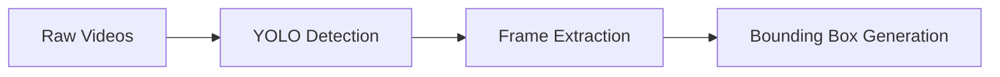

<div align="center">
  
  
  <h2>Automated Detection and Classification of Wildlife in the Chocó Forest (Canandé) using Camera Traps 🦁 🌳</h2>
  <p>A computer vision system for automated species detection and classification</p>

  <p>
    
    
    <a href="https://www.linkedin.com/in/edwin-montenegro-119570250/">
      
    </a>
  </p>
</div>

## Description

This project implements a state-of-the-art machine vision system for automatic species detection and classification in the Jocotoco Canandé Reserve, one of the most biodiverse regions on the planet. Using a dual architecture that combines YOLO models for detection and deep neural networks (ResNet50 and MobileNetV3) for classification, the system processes camera trap videos to identify and monitor six native species.

- 🦊 Central American Agouti
- 🐿️ Squirrels
- 🦡 Nine-banded Armadillo
- 🦫 Lowland Paca
- 🐀 Rodents
- 🦃 Great Tinamou

The results show that ResNet50 achieves superior performance with a weighted F1-score of 0.951 when trained with frames that exceed a 60% confidence threshold, demonstrating its effectiveness for automated biodiversity monitoring. This tool represents a significant advance in species conservation, allowing researchers and conservationists to process large volumes of data efficiently and accurately. Developed as part of an initiative to modernize conservation practices in the Ecuadorian Chocó, this project sets a precedent for the implementation of artificial intelligence technologies in the protection of critical ecosystems..

## 🔄 System Pipeline

Our two-stage pipeline automates the processing of camera trap videos for wildlife monitoring:

### 📸 Stage 1: Detection Pipeline

Implementation Details:

- Video Processing: 640x368px resolution frames
- Dual YOLO Implementation:

   - YOLOv5l: Primary detector (confidence threshold >55%)
   - YOLOv8x: Specialized for nocturnal/camouflaged species


- Frame Extraction: Up to 350 frames per video


### 🔍 Stage 2: Classification Pipeline

Model Architecture:
* ResNet50
   * Optimized for maximum precision
   * Fine-tuned on ImageNet weights
   * Full feature extraction capability
* MobileNetV3
   * Designed for computational efficiency
   * Lightweight architecture
   * Suitable for real-time applications
* Transfer Learning
   * ImageNet pre-trained weights
   * Adaptive layer freezing
   * Custom classification heads
* Data Augmentation Suite
   * RandomCrop: Variable frame sections
   * RandomHorizontalFlip: Mirror imaging
   * RandomRotation: Orientation variety
   * ColorJitter: Lighting adaptation
* Class Imbalance Handling
   * Adaptive class weights
   * Loss function modification
```python
# ResNet50 Configuration
resnet_config = {
   'architecture': 'ResNet50',
   'weights': 'imagenet',
   'features': 'full extraction',
   'optimization': 'maximum precision'
}

# MobileNetV3 Configuration
mobilenet_config = {
   'architecture': 'MobileNetV3',
   'design': 'lightweight',
   'target': 'real-time inference',
   'efficiency': 'computationally optimized'
}
```
<p align="center">
  
  <br>
  <em>Figure 1: Block diagram of the proposed processing pipeline.</em>
</p>


## 📊 Dataset
The dataset consists of 780 camera trap videos (130 for each of the six target species) captured in the Jocotoco Canandé Reserve. The data were divided into three sets: 70% for training, 15% for validation, and 15% for testing. Processing using YOLO detectors resulted in approximately 33,000 relevant frames, providing a solid basis for training and evaluating the classification models.

## 📁 Project Structure
```
wildlife-monitoring/
├── Analysis_dataset/                 # Data Analysis & Visualization
│   └── Category analysis.ipynb/      # Dataset statistics and insights
│
├── Dataset_frames/           # Processed Detection Frames
│   ├── by_species/          # Organized by animal category
│   └── metadata/            # Frame annotations and statistics
│
├── YOLO_detection/       # Object Detection Pipeline
│   └── models/           # Detection utilities
│
├── Models/                  # Classification Models & Experiments
│   ├── mobilenetv3/        # MobileNetV3 implementations
│   │   ├── conf60/        # 60% confidence threshold
│   │   └── conf70/        # 70% confidence threshold
│   │
│   └── resnet50/          # ResNet50 implementations
│       ├── conf60/        # 60% confidence threshold
│       └── conf70/        # 70% confidence threshold
│
└── requirements.txt        # Environment dependencies
```
### Key Components:
- **Analysis Tools**: Comprehensive notebooks for dataset exploration and result visualization
- **Detection Pipeline**: YOLO-based frame extraction and animal detection
- **Classification Models**: PyTorch Lightning implementations with configurable confidence thresholds
- **Dataset Management**: Organized frame storage with metadata tracking

**Note**: Raw video data and extracted frames are stored in a secure private container to maintain data integrity and privacy.

## 📋Requirements
- torch>=2.3.0
- torchvision>=0.18.0
- pytorch-lightning>=2.4.0
- ultralytics>=8.2.81
- opencv-python>=4.8.0
- pandas>=2.0.3
- numpy>=1.25.2
- Pillow>=9.4.0
- scikit-learn>=1.2.2
- matplotlib>=3.7.1
- seaborn>=0.13.1
- torchmetrics>=1.4.1
  
## ⚙️ Installation  & Usage Guide

```
# Clone repository
git clone https://github.com/username/wildlife-monitoring
cd wildlife-monitoring

# Create virtual environment (recommended)
python -m venv venv
source venv/bin/activate  # or `venv\Scripts\activate` on Windows

# Install dependencies
pip install -r requirements.txt
```
  

### Frame Detection Setup
The first step is to process the videos using the YOLO detector to extract relevant frames:
```
# YOLO Detector Setup
from ultralytics import YOLO

# Load the model
model = YOLO('yolov8x.pt')  # o 'yolov5l.pt'

# Configure parameters
conf_threshold = 0.55  # Umbral de confianza >55%
max_frames = 350      # Frames máximos por video

# Run detection
results = model(video_path, conf=conf_threshold)
```
This process will generate a dataset of frames with their respective bounding boxes for each detected species.

###  Classification of Species
Once the frames have been obtained, the classifier is trained:
```
# Setting up the classification model
from pytorch_lightning import Trainer

# Define hyperparameters
hyperparameters = {
    'learning_rate': 0.0001,
    'batch_size': 32,
    'max_epochs': 100,
    'early_stopping': 10
}

# Start training with monitoring
trainer = Trainer(
    max_epochs=hyperparameters['max_epochs'],
    accelerator='gpu',
    logger=TensorBoardLogger('logs/'),
    callbacks=[EarlyStopping(monitor='val_loss', patience=10)]
)
```
### Monitoring and Evaluation
Training results can be visualized in real time using TensorBoard:
```
tensorboard --logdir=logs/
```
In the TensorBoard interface you can monitor:
Access http://localhost:6006 to view:

- Training progress
- Performance metrics by species
- Visualizations of confusion matrices
- ROC curves for performance evaluation
